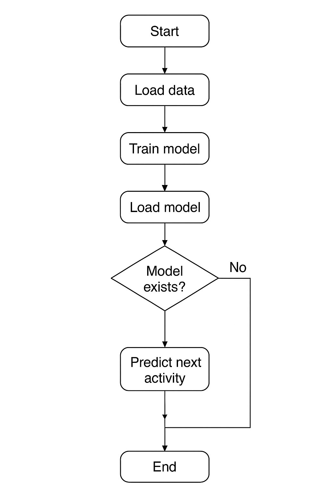

# 🧠 AI Activity Predictor – TriathlonForge

This module implements a simple AI system that predicts the **next user activity** based on the last 15 recorded ones.  
It uses **TensorFlow** to train and load a custom model, which can later be integrated into the main API or run as a separate service.

---

## ⚙️ How It Works

The process follows a basic training and prediction loop:

1. **Load data** – Retrieve the last 15 user activities from the database or API.  
2. **Train model** – If the model does not exist, train it using TensorFlow.  
3. **Save model** – Store the model in the local directory (`models/activity_model.h5`).  
4. **Load model** – If the model already exists, load it.  
5. **Predict next activity** – Based on previous patterns, predict the user’s next likely activity.  


---

## 🧩 Flowchart

Below is the structural flowchart showing the algorithm process:



---

## 🧠 Pseudocode

```python
start
  if model exists:
      load model
  else:
      load training data
      preprocess data
      train model
      save model

  new_data = get_last_15_activities(user_id)
  prediction = model.predict(new_data)
  output(prediction)
end
